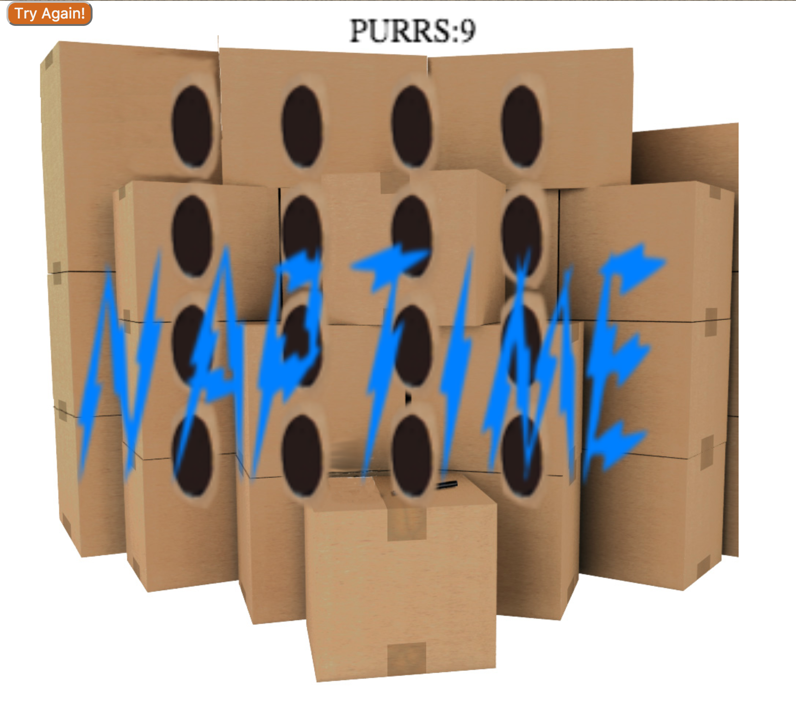

# Feed the Cats

[Feed the Cats](https://eddielao.github.io/feed-the-cats/)



## Features & Implementation

Feed the Cats plays much like whack a mole but, instead of whacking, we are feeding. The game utilizes the Enchant JS library. The game is not time based but instead each game is fixed with number of chances the player get to feed.

To start the game, simply click on start. The cats are fed by simply clicking on a cat with your cat-treat mouse pointer. There is a "try again" button on top left of game to restart the game at anytime. The transition of cat appearing and disappearing is controlled with the flash() function where they are implemented with modes together with the different frames inside the image sprite sheet.

```js
flash() {
   if(game.frame % 2 != 0)return; //Run every 2 frames
   switch(this.mode) {
      case 0: //cat is appearing
         this.frame++;
         if(this.frame>=4){
            /*Switch to Mode 2 (waiting)
             *after appearing completely.*/
            this.mode=2;
            /*The next mode to transition to
             *is mode 1 (hide).*/
            this.nextMode=1;
            this.waitFor = game.frame + generateRandNum(30);
         }
         break;

      case 1://cat hides in the hole
         this.frame--;
         if(this.frame<=0){
            /*Switch to Mode 2 (waiting)
             *after hiding.*/
            this.mode=2;
            /*The next mode to transition to
             *is mode 0 (appear).*/
            this.nextMode=0;
            this.waitFor = game.frame + generateRandNum(200);

            this.currentTreat = false;

            //Reduce maximum amount of cats
            numCats--;

           if(numCats<=0) {
               this.mode=3;
               if(numCats <= -1*totalCats + 1) {
                   game.end(purrLabel.score, purrLabel.text);
               }
             }
         }
         break;

        case 2://Wait
           if(game.frame>this.waitFor){
                this.mode = this.nextMode;
           }
           break;

        //Do nothing
        case 3:
           break;
   }
}
```

The game area turns the user's mouse pointer to a cat treat. Every element in the game is related to a cat theme, from the boxes with holes to the ending screen (saying "nap time"), instead of outputting "game over". After the cats appears for the fixed number of times, the game is over.

## Future Dirctions for the Project

There are many additional features in the plan, such as sound and different mode of challenges. Another more time consuming addition would be to add other animals (such as mice).

Adding other animals can turn the game to end after feeding the any non-cat animals a certain times.
