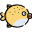

## Feed a Cat

### Background

Feed a Cat is largely based on the classic game Whack a Mole. Instead of using a hammer to hit a mole, the hammer is replaced by cat treat, most likely a fish or a piece of cat treat (see sample pictures below).

A twist to help keep the game interesting is that, in addition to cats popping out of the hole, there will also be other type of animals popping out. Feeding any non-cat animal will cost the player one life, the game ends when user loses 3 lives. The difficulty gradually increases by the amount of time any animal stays up (or the amount of time a user has to feed that animal).

### Functionality & MVP

Feed a Cat lets the user do the followings.

- [ ] Start game
- [ ] Pause game
- [ ] Reset game
- [ ] Feed an animal
- [ ] A production readme

### Wireframes

Like most web browser games, Feed a Cat will be a single screen game.

### Architecture and Technologies

This project will be implemented with the following technologies:

- Vanilla JavaScript and jquery for overall structure and game logic,
- `Enchant.js` with HTML5 Canvas for DOM manipulation and rendering,

Enchant provides a class called Sprite that gives quite a few functionalities in manipulating game image files, such features include rotate, opacity, visible, and intersect.

The game will be comprised of several files. The followings are some of the files.

- [ ] A hole class (representing the hole that animals will be coming out of)
- [ ] A file containing most of the game logics needed for this game
- [ ] A game file to run the game
- [ ] A CSS file containing all game related stylings
- [ ] 5 different cats with 3 to 4 transitions representing different stages of moving out and back to a hole and also one image representing for each of the 5 cats (smiling to imitate successful feeding)
- [ ] At least 2 other types of animals with similar transition images (if user mistakenly feeds any other animal, point will be deducted)
- [ ] An icon (fish or cat treat) to represent mouse pointer

### Implementation Timeline

**Day 1**: Setup project directories and shell files. Define the index html file needed for the game.

- Decide on how the game should be structured in term of JS objects
- Research on `Enchant.js` and HTML5 info needed to make the game

**Day 2**: This day will be spent to create all the graphics needed for the game.

- Create about 5 different cat images (some showing cat with mouthful of food indicating being fed)
- Create another 5 different images with other animal type similarly
- Start on the scripting

**Day 3**: Create the game logic and finish most of the JavaScript coding. By end of today, a skeleton of the game should be finished and be at least somewhat ready to be tested/played.

- Finish all class definitions
- Finish all functions (needed for the game logics)
- Finish the game file (to run the game)

**Day 4**: Test the game and style the front end. Game sound will also be implemented today.

- Define CSS stylings
- Debug by running the game in as many scenarios as possible (trying to break it)

### Bonus Features

One feature to implement if time allows is to make the holes appear on random location within the game board.
